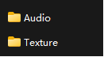
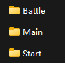
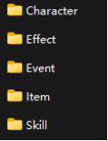

小小侠客模拟器创意工坊指南

欢迎来到小小侠客模拟器的创意工坊! 在这里，你将亲手打造属于自己的武侠世界。请参考以下指南，开启你的江湖创作之旅。

1. 上传模组

在开始界面里找到上传模拟，选择一个模组文件（WorkshopTestContent），填写模组名称，预览图，描述之后即可上传。

1. 模组文件结构

文件结果可参考GitHub中WorkshopTestContent文件夹

可下载WorkshopTestContent文件夹并直接在里面修改

在Audio文件夹里替换音乐

在Texture文件夹里替换图片

1. Audio文件夹

分别是战斗音乐，主题曲，和开始界面音乐

同一个文件夹内可导入多首MP3格式文件，游戏中会随机播放。

1. Texture文件夹

目前可以仅可更改图片，文件名字为想替换的东西

Character：改变角色立绘，图片文件名改成想要更改的角色名称，角色可以是任意角色，敌人，操控角色，图片尺寸直接影响游戏内角色大小，一个标准的人物高度为800像素，为了游戏内特效显示效果考虑，请尽量让人物居中。

Effect：改变效果图标，包括特性，计略，各种buff效果，无具体像素要求，但请保持图片比例1：1

Event：更改三选一事件图标和事件背景图，无具体像素要求，但请注意三选一事件图标长宽比为3：2，事件背景图长宽比为8：3

Item：更改宝物图标，图片比例1：1

Skill：更改技能招式图标：图片比例1：1

