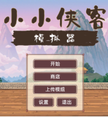
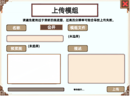

 
# 🥋 小小侠客模拟器 创意工坊指南

欢迎来到《小小侠客模拟器》的创意工坊！  
在这里，你可以亲手打造属于自己的武侠世界，无论是更换立绘、修改技能图标，还是替换音乐，皆可通过模组轻松实现。

请参考以下指南，开启你的江湖创作之旅 

---

## 一、上传模组

1. 在游戏**启动界面**中点击 **“上传模组”**
2. 选择一个模组文件夹（推荐以 [WorkshopContentSample](https://github.com/MiniFunGame/MiniMartialWorldWorkShop) 为模板调整）
3. 填写以下信息：
   - **模组名称**
   - **模组描述**
   - **预览图**（建议不要过于清晰，分辨率过高可能导致上传失败）
4. 点击上传，等待 Steam 完成创意工坊同步

---

## 二、模组文件结构说明

你可以从 GitHub 下载模组示例文件夹并在其中直接修改：  
🔗 示例模组地址（含结构说明）：  
👉 [https://github.com/MiniFunGame/MiniMartialWorldWorkShop](https://github.com/MiniFunGame/MiniMartialWorldWorkShop)

文件夹结构如下：

```
WorkshopContentSample/
├── Audio/
│   ├── Start/     （开始界面音乐）
│   ├── Main/      （主界面音乐）
│   └── Battle/    （战斗音乐）
└── Texture/
    ├── Character/ （角色立绘）
    ├── Skill/     （技能图标）
    ├── Effect/    （效果图标）
    ├── Item/      （宝物图标）
    └── Event/     （事件图标和背景）

```

---

## 三、音频文件说明（Audio）

- 支持格式：`.mp3`（推荐），`.ogg`，`.wav`
- 同一个文件夹内可放多首音乐，游戏中会**随机播放**
- 三类音乐目录：
  - `Start/` 开始界面音乐
  - `Main/` 主界面背景音乐
  - `Battle/` 战斗音乐

---

## 四、图片资源说明（Texture）

### ✅ Character（角色立绘）

- 替换任何角色（敌人/主角/NPC）
- **文件名 = 角色名**（例如：张三.png）
- 标准人物高度为 **800 像素**
- 图片居中可确保战斗特效正确显示

### ✅ Skill（技能图标）

- 替换武学招式图标
- 推荐比例：**1:1**

### ✅ Effect（特性/状态图标）

- 替换特性、状态、buff 图标
- 无像素限制，但建议保持 **1:1 比例**

### ✅ Item（宝物图标）

- 替换宝物/神器图标
- 推荐比例：**1:1**

### ✅ Event（三选一事件相关）

- 替换事件图标 & 背景图
- 图标比例建议为 **3:2**
- 背景图比例建议为 **8:3**

---

## 📦 五、快速开始模板下载

官方示例模组文件夹：  
📎 [WorkshopContentSample on GitHub](https://github.com/MiniFunGame/MiniMartialWorldWorkShop)

你可以 Fork 或直接下载该仓库，基于已有目录和示例快速开发自己的模组！

---

## 🎉 六、建议与注意事项

- 预览图请勿过于清晰（建议宽度 <1024px，大小 <1MB），否则可能上传失败
- 确保文件夹结构与示例一致，否则游戏可能无法识别内容
- 文件名请避免使用特殊符号或空格

---

如有更多问题或建议，欢迎在 Steam 创意工坊评论区或 GitHub 留言，我们会持续改进！

—— 小小侠客模拟器开发组 敬上
